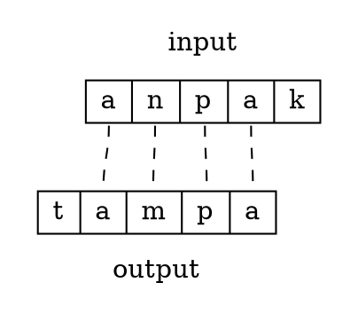

# Candidates

## Input

The input in OT consists of a sequence of segments. The segments could be feature matrices or more articulated autosegmental representations. However, the input is *not* restricted to phonemes, or the contrastive sounds of the language. In OT, **there are no language-specific restrictions on the input**. This principle is known as **Richness of the Base**. 

> Richness of the Base is sometimes incorrectly summarized as "anything can be an input", but this is not quite right: the range of possible inputs must still be explicitly defined and restricted, yet these restrictions hold across *all* languages.

Additionally, it us usually assumed that there is no prosodic structure in the input. This includes syllable and metrical structure. If there is lexical stress in a language, it can be treated as a feature on a specific segment, and then based on the ranking for that language, the resulting prosodic structure will match accordingly. In OT, all syllabification and stress is decided concurrently with other segmental processes. 

## Output

The output candidates are a direct result of a given input and the definition of GEN. Every combination of processes allowed by GEN should be present in some output candidate, for the most part. Often, this results in an infinite output set: every possible kind of epenthesis simply creates more and more candidates. However, many of the resulting candidates will be [harmonically bounded](harmonic-bounding.md) and do not need to be considered further. 

The infinite candidate set is often misconstrued by saying "anything can be a candidate" in OT; this is also incorrect. The set may be infinite, but that doesn't mean every possible phonological form (or anything non-phonological) is a candidate (my cat is not a candidate); only those forms as allowed by GEN. 

## Correspondence

Correspondence is an explicitly-defined relation between the input and output. Each segment in the input is potentially in correspondence with a segment from the output. This relation enables constraints to track the differences between input and output forms. The figure below shows a number of possible correspondence situations.

In example , the initial [t] in the output has no correspondent in the input, and the segment /k/ in the input has no correspondent in the output. Additionally, while /m/ is in correspondence with [n], these two segments are not identical. This results in a variety of **faithfulness** violations.
