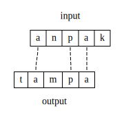

# Constraints

In strict-domination OT, constraints are functions from candidates to non-negative integers. Because a [candidate](candidates.md) is a triplet consisting of (input, output, correspondence), the constraint has access to this structure. Constraints that only consider the output structre are called **markedness** constraints, and constraints that refer to both the input and output structure (and the relation between them) are (usually) **faithfulness** constraints.[^1]

## Constraint definitions

Constraints are said to be negative, meaning they assign violations based on the presence of structure. Intuitively, this  is like thinking "don't have this", rather than "do have that". Because constraints can assign multiple violations per candidate, their definitions should be given in a way that makes this counting clear. Consider the following constraint:

Don't have codas.

How would this assign violations to a form like [tak]? What about [task], or [taktak]? Do you need to make additional assumptions? The definition in <lref> is ambiguous. Here are some explicit alternatives:

Assign a violation for every syllable node that dominates a Coda node.

Assign a violation for every segment that is dominated by a Coda node. 

A good informal model for constraint definitions in general is *Assign a violation for every x such that...*. The following VT shows how violations can now be clearly defined (and how these v2 and v3 crucially differ):

|     |        | NoCoda | NoCoda v2 | NoCoda v3 |
| --- | ------ | ------ | --------- | --------- |
|     | ta     | 0      | 0         | 0         |
|     | tak    | 1      | 1         | 1         |
|     | task   | ?      | 1         | 2         |
|     | taktak | ?      | 2         | 2         |

It will be up to the analyst to determine whether the definition in v2 is deirable, or that in v3, or some alternative. What is crucial, however, is that the chosen definition is clear and explicit. 

## Common faithfulness constraints

Max, Dep, and Ident are three common faithfulness constraint types that control deletion, insertion and featural changes, respectively. They are based in [correspondence](candidates.md) theory. Their original definitions (for input-output correspondence) from {{#cite McCarthyPrince1995}} are shown below. 

"Every segment of the input has a correspondent in the output."

"Every segment of the output has a correspondent in the input."

"Output correspondences of an input [\\(\alpha\\)F] segment are also [\\(\alpha\\)F]."

Because the definition crucially references both the input and output portions of the candidate (and thus the correspondence relationship between them), these are faithfulness constraints. 

> How would you reword the above definitions to make the violation counting more explicit?

In the example candidate from [here](candidates.md), there is exactly one violation for each of the above three constraints. 

The input segment /k/ has no correspondent in the output, and thus this candidate incurs one Max violation. Likewise, the output segment [t] has no correspondent in the input, and thus there is one Dep violation. Likewise, /n/ is in correspondence with [m] (indicated by the connecting line), yet these two segments differ in their place features, so there is a violation of Ident.

> IdentIO is usually defined on a per-feature basis (e.g. IdentIO-voice), yet there are multiple place features that are different between /n/ and [m]. How would different, explicit definitions of the relevant IdentIO constraints count violations?

Note that two candidates can have the same input and output strings but different correspondence relations, and this different violation profiles. Compare the previous candidate to the one below.

Both show the mapping of /anpak/ → [tampa]. However, in <lref>, there is no correspondence between /n/ and [m]. This means that there are two violations each of Max and Dep: the /n/ is deleted, and the [m] is inserted. The following VT shows the differences:

|     | /anpak/   | Max | Dep | Ident |
| --- | --------- | --- | --- | ----- |
|     | tampa (5) | *   | *   | *     |
|     | tampa (6) | **  | **  |       |

The number after the output shows the diagram with the correspondence relations for that candidate. Correspondence is one type of "hidden" structure, and the correct correspondence structure is determined in the course of analysis rather than in phonetic transcription.

---

[^1]: Usually, because *anti-faithfulness* is also a thing: while faithfulness constraints penalize differences between input and output, anti-faithfulness constraints are useful when the output must differ in a particular way from the input. 

