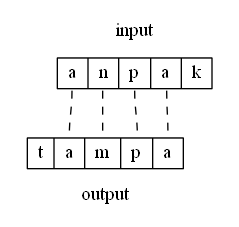
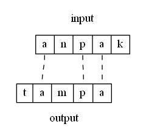

# Constraints

In strict-domination OT, constraints are functions from candidates to non-negative integers. Because a [candidate](candidates.md) is a triplet consisting of (input, output, correspondence), the constraint has access to this structure. Constraints that only consider the output structre are called **markedness** constraints, and constraints that refer to both the input and output structure (and the relation between them) are (usually) **faithfulness** constraints.[^1]

Constraints are said to be negative, meaning they assign violations based on the presence of structure. Intuitively, this  is like thinking "don't have this", rather than "do have that". Because constraints can assign multiple violations per candidate, their definitions should be given in a way that makes this counting clear. A good informal model for a constraint definition is *Assign a violation for every x such that...*. For example:

Assign a violation for every syllable node that dominates a Coda node.

Informal verions of this constraint might be phrased as *don't have a coda*, but this is ambiguous. If a candidate contains multiple codas, is it one violation total, or on per coda node? The definition in <lref> makes this clear. The definition in <lref> also means that only one violation will be assigned to a syllable with *multiple* codas. This may or may not be desirable; that's up to the analysis. It is, however, completely unambiguous. 

## Common faithfulness constraints

Max and Dep are two common faithfulness contraints that control deletion and insertion, respectively. They are based in [correspondence](candidates.md) theory. Their original definitions from {{#cite McCarthyPrince1995}} are shown below. 

"Every segment of the input has a correspondent in the output."

"Every segment of the output has a correspondent in the input."

"Output correspondences of an input [\\(\alpha\\)F] segment are also [\\(\alpha\\)F]."

Because the definition crucially references both the input and output portions of the candidate (and thus the correspondence relationship between them), these are faithfulness constraints. 

> How would you reword the above definitions to make the violation counting more explicit?

In the example candidate from [here](candidates.md), there is exactly one Max violation and one Dep violation.

The input segment /k/ has no correspondent in the output, and thus this candidate incurs one Max violation. Likewise, the output segment [t] has no correspondent in the input, and thus there is one Dep violation.

Note that two candidates can have the same input and output strings but different correspondence relations, and this different violation profiles. Compare the previous candidate to the one below.

Both show the mapping of /anpak/ → [tampa]. However, in <lref>, there is no correspondence between /n/ and [m]. This means that there are two violations each of Max and Dep: the /n/ is deleted, and the [m] is inserted. The following VT shows the differences:

|     | /anpak/   | Max | Dep | Ident |
| --- | --------- | --- | --- | ----- |
|     | tampa (5) | *   | *   | *     |
|     | tampa (6) | **  | **  |       |

The number after the output shows the diagram with the correspondence relations for that candidate. Correspondence is one type of "hidden" structure, and the correct correspondence structure is determined in the course of analysis rather than in phonetic transcription.

---

[^1]: Usually, because *anti-faithfulness* is also a thing: while faithfulness constraints penalize differences between input and output, anti-faithfulness constraints are useful when the output must differ in a particular way from the input. 

