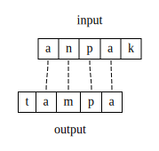
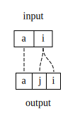
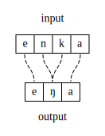
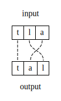

# Correspondence

Correspondence is a relation \\(\mathcal{R}\\) between segments. Here and in {{#cite McCarthyPrince1995}}, the input and outputs consist of strings of segments, with each segment having an number of featural definitions. In input-output (IO) correspondence, the relation \\(\mathcal{R}\\) is defined over \\(S_i \times S_o\\), which is the set of input segments and the set of output segments, respectively. 
Correspondence itself is a kind of hidden structure and has no phonetic realization beyond what effects correspondence-referring constraints have on the segments themselves in the various mappings. 

The example below shows the input string /anpak/, the output string [tampa], and the various correspondence relations between segments.

The above diagram is equivalent to saying explicitly:

\\[ \mathcal{R} = \\{(\text{a}^1_i,\text{a}^1_o), (\text{n}_i,\text{m}_o), (\text{p}_i, \text{p}_o), (\text{a}^2_i,\text{a}^2_o)\\} \\]

(The superscripts serve to differentiate the two unique segments [a]). It is also common to see correspondence relations indicated as subscripted numeras on each segment, so the above again could be shown as the following:

\\[ /\text{a}_1\text{n}_2\text{p}_3\text{a}_4\text{k}/ \rightarrow [\text{t}\text{a}_1\text{m}_2\text{p}_3\text{a}_4] \\]

Segments with shared numerical indices are in correspondence with each other. Segments with no index, or with an index that has no matching value, are *not* in correspondence with each other. This style of presentation is useful for showing correspondence relations in tableaux, though heavily-index candidates can be hard to parse by the reader. 

## Other IO correspondence configurations

The examples thus far have shown a one-to-one correspondence relation, which the relative order of segments in correspondence preserved. Depending on the analysis/definition of GEN, further configurations are possible. 

### Splitting

Splitting is when a single input segment has two correspondents in the output.

### Coalescence

Coalescence, also called fusion, is when two input segments have a single output correspondent.

### Metathesis

Metathesis is a process where only the order of segments has changed. Thus it can still be modeled by a one-to-one relation, but with input correspondents having a different linear order than their output correspondents. 

> How do Max, Dep, and Ident assign violations to the above configurations? What other types of constraints might be necessary, and how would these be defined?

## Correspondence beyond inputs and outputs

{{#cite McCarthyPrince1995}} apply correspondence for inputs and outputs as is done here, and also between a **base** and **reduplicant**, to model processes of reduplication. Both the base and reduplicant are in the same output string, but parallel verions of Max, Dep, and Ident (or whatever other constraints) operate over this relation.

{{#cite Benua1997}} uses **output-output correspondence** to explain similarities among words in the same paradigm. For instance, segments in the output of *military* might be in correspondence with segments in the output of *militaristic*. Not that OO correspondence does **not** mean correspondence between two segments in the *same* output string.

Long-distance processes are modeled with **surface correspondence** in {{#cite RoseWalker2004}}, {{#cite Hansson2010}}, {{#cite Bennett2013}}, among others. Here, two segments in the same output (or surface) form can potentially be in correspondence with each other, and there is again a parallel family of Ident and related constraints to control this relation. It is also sometimes abbreviated CC correspondence (usually in reference to two consonants in correspondence).