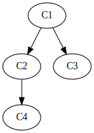
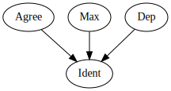

# Rankings

Understanding the logic of rankings is essential to understanding the logic of OT. An OT grammar is a ranking of constraints. In formal terms, an OT grammar is a *set of partial orders*. 

## Definitions

A **total order** over a set of elements means that every element is in an ordering relation with every other element. The set of positive integers is a total order, for example, because given any two numbers, a decision can be made as to which is greater than the other. A **partial order** over a set of elements means there exists at least some elements which are not in an ordering relation with some other elements. If you consider all university students and compare them in terms of class rank (firstyear, sophomore, junior and senior), you have a partial order. Given two students, it might be possible to rank them (if one is a sophomore and the other is a junior), or there might be no ordering between them (if they are both firstyears). 

A single partial order can be visually represented with a **Hasse diagram**. In a Hasse diagram (as they are used in OT), items towards the top are ordered ahead of connected items below. This is an ordinary domination relation, and in OT grammars certain constraints are said to dominate other constraints. An example Hasse diagram is below:

<div class="fig" title="Example Hasse diagram">

<!-- ```dot process example-hasse
digraph G {
    C1 -> C2;
    C1 -> C3;
    C2 -> C4;
}
``` -->



</div>

In the above, C1 and C2 are ordered with respect to each other, as are C1 and C3, and C2 and C4. The items *not* ordered are C2 and C3, and C3 and C4. There are thus a number of total orders that are *consistent with* the partial order represented in <lref>. These total orders are:

1. C1 ≫ C2 ≫ C4 ≫ **C3**
2. C1 ≫ C2 ≫ **C3** ≫ C4
3. C1 ≫ **C3** ≫ C2 ≫ C4

Notice how C3 is a bit of a roamer: it can appear anywhere in the total order, as long as it is ordered after C1. 

To summarize, a Hasse diagram represents a partial order, and a partial order is consistent with a set of total orders. 

## Grammars in OT

An OT grammar is a set of partial orderings over the constraints in CON. Sometimes, an analysis results in a grammar that is a total order, and sometimes one that is a single partial order. The grammar is one that is determined by the proper set of winner~loser comparisons as shown in a [CT](tableaux.md). 

Certain constraints can **dominate** other constraints. Comparative tableaux directly give us information about what constraints dominate others.

<div class="ottab hy" title="Hybrid CT">

| /panpa/ | Max   | Dep    | Agree  | Ident |
| ------- | ----- | ------ | ------ | ----- |
| pampa   |       |        |        | \*    |
| panpa   |       |        | W   \* | L     |
| papa    | W  \* |        |        | L     |
| panapa  |       | W \*   |        | L     |

</div>

In <lref>, each row tells us an [elementary ranking condition](erc.md). For each row, *some* constraint that assigns a W must dominate *all* constraints that assign an L. If there is a consistent analysis for the language, then you will end up with a set of partial orders by following this logic.

In this example, each row has only one W and one L, so they can be summarized as follows:

1. Row a states that Agree must dominate Ident
2. Row b states that Max must dominate Ident
3. Row c states that Dep must dominate Ident

Notice we have orderings that must hold between some elements, but not all. This is clear when the above is shown in a Hasse diagram:

<div class="fig" title="Ranking for CT">

<!-- ```dot process example-ct
digraph G {
    Agree -> Ident;
    Max -> Ident;
    Dep -> Ident;
}
``` -->



</div>


