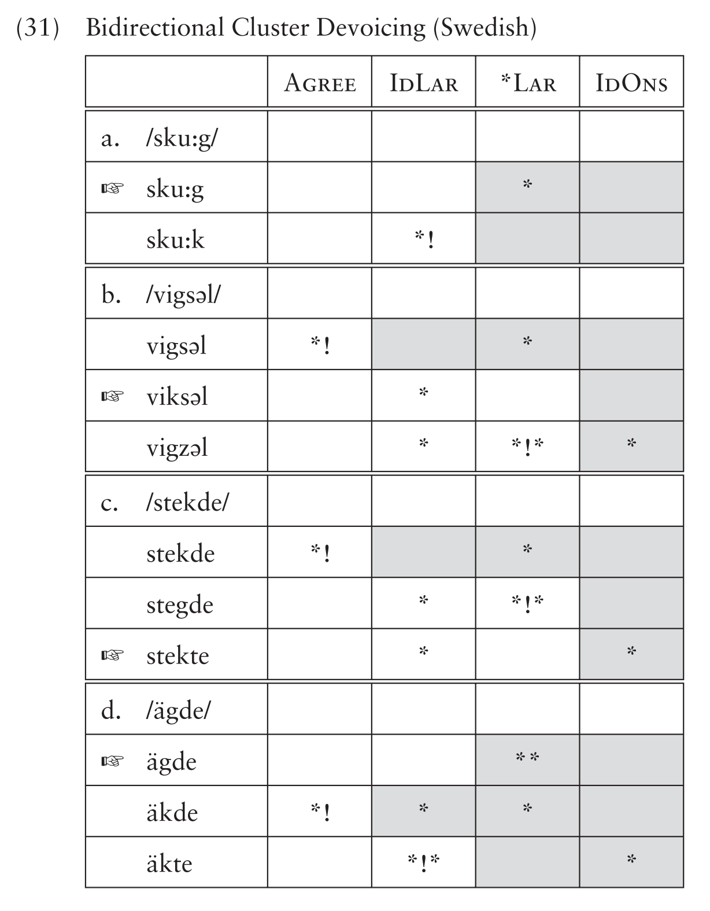

# Walkthrough

Below is a brief walkthrough of (part of) an existing analysis. The following tableaux are reproduced from {{#cite Lombardi1999}}.

<!--  -->

| A.  | /skuːg/ | Agree | IdLar | \*Lar | IdOns |
| --- | ------- | ----- | ----- | ----- | ----- |
| →   | skuːg   |       |       | 1     |       |
|     | skuːk   |       | 1     |       |       |

| B.  | /vigsəl/ | Agree | IdLar | \*Lar | IdOns |
| --- | -------- | ----- | ----- | ----- | ----- |
|     | vigsəl   | 1     |       | 1     |       |
| →   | viksəl   |       | 1     |       |       |
|     | vigzəl   |       | 1     | 2     | 1     |

| C.  | /stekde/ | Agree | IdLar | \*Lar | IdOns |
| --- | -------- | ----- | ----- | ----- | ----- |
|     | stekde   | 1     |       | 1     |       |
|     | stegde   |       | 1     | 2     |       |
| →   | stekte   |       | 1     |       | 1     |

| D.  | /ägde/ | Agree | IdLar | \*Lar | IdOns |
| --- | ------ | ----- | ----- | ----- | ----- |
| →   | ägde   |       |       | 2     |       |
|     | äkde   | 1     | 1     | 1     |       |
|     | äkte   |       | 2     |       | 1     |

The VTs in <lref> show for inputs for the same language (here, one similar to Swedesh). Because the same target language is being described, each underlying form and its respective set of [candidates](candidates.md) are evaluated against the same [ranking](rankings.md) of [constraints](constraints.md). 

The constraints in these VT are briefly defined below. The first two are markedness constraints, meaning they assign violations based only on the output structure. 

Assign a violation for every pair of adjacent output segments that do not agree in their laryngeal specification.

Assign a violation for every voiced output segment.

The following two are faithfulness constraints; they assign violations based on differences between the input and output segments. 

Assign a violation for every input segment whose corresponding output segment has a different laryngeal specification.

Assign a violation for every input segment whose corresponding output segment has a different laryngeal specification, and that output segment is a syllable onset.

In Tableau A, the winner is [skuːg], even though this violates \*Lar. The loser, [skuːk], does *not* violate \*Lar but it does violate IdLar, which penalizes changing a laryngeal feature from the input to the output. For this language, IdLar must dominate (be more important than) \*Lar.

In Tableau B, the winner is [viksəl], and it is shown here with two losers. The candidate [vigsəl] loses because it violates Agree, as the voiced [g] is adjacent to the voicecless [s]. In this ranking, Agree is undominated, so this candidate is ruled out. Both remaining candidates have one violation for IdLar, so this constraint does not make a distinction. While both remaining candidates have changed the voicing of one segment to satisfy Agree, the loser [vigzəl] does so by having a pair of voiced segments, which incurs 2 violations of \*Lar, while the intended winner [viksəl] incurs none. 

In Tableau C, the winner is [stekte]. This candidate unfaithfully maps an input /d/ to output [t]. The faithful candidate violates Agree, and like in Tableau B above, changing the cluster to two voiced segments would incur two violations of \*Lar, so both segments become voiceless.

However, in Tableau D, the winner, [ägde], *does* have a sequence of two voiced consonants. However, it got there by doing nothing: even though it has two violations of \*Lar, it has 0 violations for IdLar, as it is completely faithful. The losing candidate with two voiceless segments, [äkte], has 0 \*Lar violations, but 2 IdLar violations. As IdLar dominates \*Lar, it still loses. 

